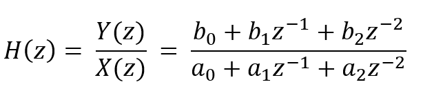
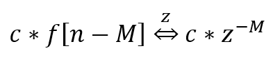
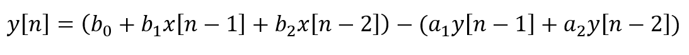

# Biquad
Small C library for implementing second order IIR filters.

Biquad Filters are named after the pair of second order polynomials. The transfer function in the z domain is shown:



We can exploit the time-shifting property of z-domain transforms:



To find the time-domain difference equation:



This library implements this difference equation by keeping 'delay lines' of input x and output y along with the coeffecients a1, a2, b0, b1, b2. After setting up the filter all state, delays and calculations are handled by calls to BQ_process().

## Set-up

```C
/* allocate a biquad structure at compile time */
biquad_t filter;

/* BQ_init() links the ring buffers and sets inital conditions to 0 */
BQ_init(&filter);

/* Set the 2nd order transfer function numerator coeffecients
 *  analog to matlab's B = [0.0039 0.0078 0.0039]
 */
BQ_setNum(&filter, 0.0039, 0.0078, 0.0039);

/* Set the 2nd order transfer function numerator coeffecients
 *  analog to matlab's A = [1.0 -1.8153 0.8310]
 *  only two values are needed, filter coeffecients must be normalized
 *  with resepct to A[0]
 */
BQ_setDen(&filter, -1.8153, 0.8310);
```

## Basic Use

After a filter is initialized it can be fed a stream of data for sample-by-sample processing.
In our use case the filter runs in a receive interrupt with a memory-mapped I2S audio interface.

```C

float sampleIn;
float sampleOut;

void tx_interrupt()
{
  I2S->WRITE = sampleOut;
}

void rx_interrupt()
{
  sampleIn = I2S->READ;
  sampleOut = BQ_process(&filter, sampleIn);  /* single stage biquad filtering */
}
```

## Verification

Coming soon I'll be uploading make files and python code to generate sweeps like the one below:


